# 🤖 LangGraph Supervised Quickstart

A **minimal example** of a multi-agent supervisor system using LangGraph v1. Designed for easy understanding and quick setup.

[](https://www.python.org/downloads/)
[](https://github.com/langchain-ai/langgraph)
[](LICENSE)

---

## ✨ What This Project Demonstrates

- 🎯 **Supervisor Pattern** - LLM-based routing to specialist agents
- 🔤 **Text Agent** - Entity extraction + keyword analysis (2 tools)
- 📊 **Data Agent** - Statistics + table formatting (2 tools)
- 💬 **Two CLI Modes** - Interactive chat and single-query
- 🌍 **Language-Agnostic Design** - No hardcoded stopwords
- 🐳 **Docker Ready** - Containerized setup included

---

## 🏗️ Architecture

```mermaid
graph TD
    User[👤 User Query] --> Supervisor[🎯 Supervisor LLM]
    
    Supervisor -->|Route Decision| Router{Routing Logic}
    
    Router -->|Text-related| TextAgent[🔤 Text Agent]
    Router -->|Data/numbers| DataAgent[📊 Data Agent]
    Router -->|Simple query| DirectResponse[💬 Direct Answer]
    
    TextAgent --> TextTools["🔧 extract_entities<br/>🔧 keyword_counts"]
    DataAgent --> DataTools["🔧 calculate_stats<br/>🔧 format_table"]
    
    TextTools --> Supervisor
    DataTools --> Supervisor
    DirectResponse --> User
    Supervisor --> User
    
    style Supervisor fill:#e1bee7,stroke:#8e24aa,stroke-width:3px
    style TextAgent fill:#c5e1a5,stroke:#558b2f,stroke-width:2px
    style DataAgent fill:#90caf9,stroke:#1976d2,stroke-width:2px
```



**How it works:**
1. **Supervisor** receives query and analyzes intent
2. **Routes** to specialist agents via tool handoff (`transfer_to_text`, `transfer_to_data`)
3. **Agents** execute tools and return results
4. **Supervisor** synthesizes final answer

---

## 🚀 Quick Start

### Prerequisites
- Python 3.10+
- OpenAI API key ([get one here](https://platform.openai.com/api-keys))
- (Optional) LangSmith API key for tracing ([get one here](https://smith.langchain.com/))

### Installation

```bash
# 1. Clone the repository
git clone https://github.com/joaomede/langgraph-supervised-quickstart.git
cd langgraph-supervised-quickstart

# 2. Create virtual environment
python3.10 -m venv .venv
source .venv/bin/activate  # Windows: .venv\Scripts\activate

# 3. Install dependencies
pip install --upgrade pip
pip install -r requirements.txt

# 4. Configure environment
cp .env.example .env
# Edit .env and add your OPENAI_API_KEY
```

### Usage

**Interactive Chat Mode (default):**
```bash
PYTHONPATH=src python -m cli
```

```
╭──────────────────────────────────────────────╮
│   🤖 Multi-Agent Supervisor System           │
│   Powered by LangGraph v1                    │
╰──────────────────────────────────────────────╯

You: Extract entities from Microsoft and Google

🤔 Thinking...

╭─────────── 🤖 Assistant │ Message #1 ──────────╮
│  Entities extracted:                           │
│  • Microsoft                                   │
│  • Google                                      │
╰────────────────────────────────────────────────╯
```

**Single Query Mode:**
```bash
PYTHONPATH=src python -m cli --query "Calculate stats for: 100, 200, 300"
```

**Interactive Commands:**
- `help` - Show available commands and tips
- `clear` - Reset conversation history
- `exit` / `quit` / `bye` - End session

---

## 🐳 Docker Support

**Interactive mode:**
```bash
# Build and run
docker compose up --build

# Or using Docker directly
docker build -t langgraph-quickstart .
docker run -it --env-file .env langgraph-quickstart
```

**Single query mode:**
```bash
docker run --env-file .env langgraph-quickstart --query "Extract entities from: Tesla and SpaceX"
```

📖 **[Complete Docker Guide →](docs/DOCKER_GUIDE.md)**

---

## 💡 Example Queries

### Text Analysis
```bash
"Extract entities from: Apple launched iPhone in California"
"Find keywords in: artificial intelligence and machine learning"
"Analyze text: OpenAI and LangGraph enable agentic systems"
```

### Data Analysis
```bash
"Calculate statistics for: 23, 45, 67, 89, 12"
"Compute mean and median of: 5, 15, 25, 35"
"Show stats table for: 100, 200, 300, 400, 500"
```

### Multi-Agent Queries
```bash
"Analyze 'Tesla and SpaceX' and compute stats for: 10, 20, 30"
"Extract entities from my text and calculate averages: 5, 10, 15"
```

---

## 🛠️ Technology Stack

| Component | Technology | Purpose |
|-----------|-----------|---------|
| **Orchestration** | LangGraph v1 | Multi-agent graph workflows |
| **LLM Framework** | LangChain | Agent creation, tool binding |
| **LLM Provider** | OpenAI GPT-4o-mini | Supervisor and agents |
| **Terminal UI** | Rich | Beautiful formatting |
| **Language** | Python 3.10+ | Type hints, modern syntax |

---

## 📁 Project Structure

```
langgraph-supervised-quickstart/
├── src/
│   ├── agent/                 # Core multi-agent system
│   │   ├── graph.py           # Supervisor + routing logic
│   │   ├── agent_builders.py  # Text & Data agent factories
│   │   ├── tools.py           # 4 tools (extract_entities, keyword_counts, calculate_stats, format_table)
│   │   └── cli.py             # Single-query mode
│   └── cli.py                 # Interactive chat mode (main entry point)
├── docs/
│   └── DOCKER_GUIDE.md
├── .env.example               # Environment configuration template
├── requirements.txt           # Python dependencies
├── Dockerfile                 # Multi-stage container build
├── docker-compose.yml         # Container orchestration
├── pyproject.toml             # Project metadata
├── LICENSE                    # MIT License
├── CONTRIBUTING.md            # Contribution guidelines
└── CODE_OF_CONDUCT.md         # Community standards
```

---

## 🤝 Contributing

This is a minimal educational example. Contributions that maintain simplicity are welcome.

**How to contribute:**
1. Fork the repository
2. Create a feature branch (`git checkout -b feature/your-feature`)
3. Commit your changes (`git commit -m 'feat: description'`)
4. Push to the branch (`git push origin feature/your-feature`)
5. Open a Pull Request

See [CONTRIBUTING.md](CONTRIBUTING.md) for guidelines.

---

## 🔧 Configuration

**Environment Variables (.env):**
```bash
# Required
OPENAI_API_KEY=sk-proj-...

# Optional (recommended for debugging)
LANGSMITH_API_KEY=lsv2_...
LANGSMITH_TRACING=true

# Optional (defaults to gpt-4o-mini)
OPENAI_MODEL=gpt-4o-mini
```

**CLI Options:**
```bash
# Enable ASCII banner in interactive mode
CLI_ASCII_BANNER=true

# Enable debug mode with verbose traces
DEBUG=true
```

---

## 📊 Project Characteristics

| Aspect | Implementation |
|--------|----------------|
| **Architecture** | Supervisor + 2 Specialist Agents |
| **Routing** | LLM-based tool handoff |
| **Tools** | 4 focused tools (2 per agent) |
| **UI** | Rich terminal interface |
| **Memory** | Last 10 messages for context |
| **Language Support** | Language-agnostic processing |
| **Modes** | Interactive + Single-query |
| **Complexity** | Minimal (educational purpose) |

---

## 🎓 What You'll Learn

This minimal example covers:
- **LangGraph v1** - Graph-based agent orchestration
- **Supervisor Pattern** - Delegating to specialist agents via tools
- **Tool-based Routing** - Agent handoff using tools (not conditional edges)
- **ReAct Agents** - Reasoning and acting pattern
- **Conversation Memory** - Managing context in multi-turn dialogues

---

## 📄 License

This project is licensed under the MIT License - see the [LICENSE](LICENSE) file for details.

---

## 🙏 Built With

- **[LangGraph](https://github.com/langchain-ai/langgraph)** - Graph-based agent orchestration
- **[LangChain](https://github.com/langchain-ai/langchain)** - LLM application framework
- **[Rich](https://github.com/Textualize/rich)** - Terminal formatting
- **[OpenAI](https://openai.com/)** - LLM provider

---

## 📚 Documentation

- 🐳 **[Docker Guide](docs/DOCKER_GUIDE.md)** - Complete containerization guide
- 📄 **[Contributing](CONTRIBUTING.md)** - Contribution guidelines
- 🔒 **[Security](SECURITY.md)** - Security policy
- 📖 **[Code of Conduct](CODE_OF_CONDUCT.md)** - Community standards

## 📞 Support

- 💬 Interactive help: Type `help` in interactive mode
- 🐛 Report issues: [GitHub Issues](https://github.com/joaomede/langgraph-supervised-quickstart/issues)
- 💡 Questions: [GitHub Discussions](https://github.com/joaomede/langgraph-supervised-quickstart/discussions)

---

**By [João Medeiros](https://github.com/joaomede)** - A minimal example for learning LangGraph v1 supervisor patterns.
